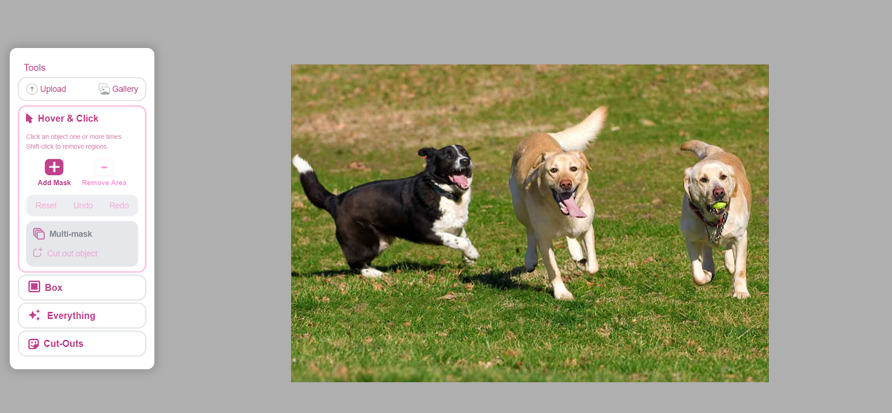
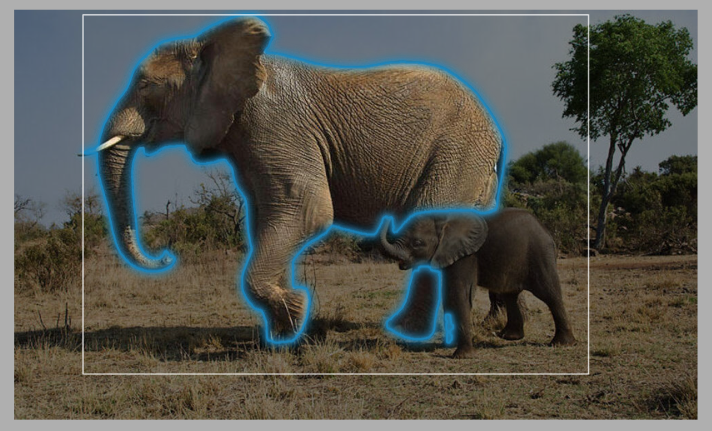

# 🖼️ Image Segmentation

## ✨ Intro Description

**Image Segmentation** is an **AI-powered system** that automatically
separates objects and regions in complex images.\
By analyzing **patterns, textures, and shapes**, it turns raw images
into precise, structured data, saving time and reducing manual work.

⚡ Works across diverse scenarios:\
- 🏭 Industrial inspection\
- 🛰️ Satellite imagery\
- 🤖 Robotics\
- 🥽 AR/VR

✅ Provides **fast, accurate, and reliable segmentation** that helps
professionals make better decisions and build smarter applications.

------------------------------------------------------------------------

## 📸 Media

-   🖼️ **Screenshots:**\

<table>
    <tbody>
        <tr>
            <td></td>
            <td></td>
        </tr>
        <tr>
            <td></td>
            <td></td>
        </tr>
        <tr>
            <td></td>
            <td></td>
        </tr>
        <tr>
            <td></td>
            <td></td>
        </tr>
        <tr>
            <td></td>
            <td></td>
        </tr>
        <tr>
            <td></td>
            <td></td>
        </tr>
        <tr>
            <td></td>
            <td></td>
        </tr>
        <tr>
            <td></td>
            <td></td>
        </tr>
        <tr>
            <td></td>
            <td></td>
        </tr>
        <tr>
            <td></td>
            <td></td>
        </tr>
        <tr>
            <td></td>
        </tr>
    </tbody>
</table>

-   📷 **Original photos:**\

<table>
    <tbody>
        <tr>
            <td></td>
            <td></td>
        </tr>
        <tr>
            <td></td>
        </tr>
    </tbody>
</table>

-   🎥 **Screen recording:** 

<table>
    <tbody>
        <tr>
            <td>
                <video src="https://github.com/user-attachments/assets/9fd51893-a2bb-44e8-83f7-72a595ef1da9" controls preload>
                    Your browser does not support the video tag.
                </video>
            </td>
            <td>
                <video src="https://github.com/user-attachments/assets/d299b0f2-0cc8-4a4b-b354-06636892f32e" controls preload>
                    Your browser does not support the video tag.
                </video>
            </td>
        </tr>
        <tr>
            <td>
                <video src="https://github.com/user-attachments/assets/148ce412-a41a-420d-9753-d554cbcbab1a" controls preload>
                    Your browser does not support the video tag.
                </video>
            </td>
            <td>
                <video src="https://github.com/user-attachments/assets/144aec35-9934-40be-a795-b114a8682a16" controls preload>
                    Your browser does not support the video tag.
                </video>
            </td>
        </tr>
    </tbody>
</table>

------------------------------------------------------------------------

## 📜 Full Description

### 🔎 Overview

In the rapidly evolving landscape of **digital image processing**,
precise and efficient image segmentation is crucial across industries.\
From **robotics and manufacturing** to **satellite imaging** and
**augmented reality**, this project delivers a **cutting-edge
algorithm** capable of segmenting complex images **accurately and
efficiently**.

------------------------------------------------------------------------

## 🚧 Problem

Accurate segmentation of complex images is a **key challenge**.\
⚠️ Standard tools fail when images contain:\
- Overlapping objects\
- Varying textures\
- Complex lighting conditions\
- Intricate patterns

✋ Manual segmentation is **slow, error-prone, and infeasible** at scale
→ demanding **AI solutions**.

------------------------------------------------------------------------

## 💡 Solution

We developed a **general-purpose segmentation system** using **deep
learning**.

-   🧠 **Custom CNN (U-Net based)** trained on diverse, annotated
    datasets.\
-   🎨 **Data augmentation** (rotation, scaling, flipping, noise) →
    strong generalisation.\
-   🪄 **Post-processing** (morphological ops, connected component
    analysis) → refined boundaries.\
-   ⚡ **Outcome**: Faster, more accurate segmentation with less manual
    work.

------------------------------------------------------------------------

## 🔄 Process

-   📥 **Data Collection & Preprocessing**: Normalization, resizing,
    augmentations.\
-   🏗️ **Model Architecture**: Enhanced **U-Net** with depthwise
    separable convolutions, attention gates & residual connections.\
-   🏋️ **Training & Validation**: Dice + Cross-Entropy loss, Adam
    optimizer, early stopping.\
-   🖌️ **Post-Processing**: Morphological operations & boundary
    refinements.\
-   📊 **Evaluation & Iteration**: Metrics → Dice coefficient,
    precision, recall.

------------------------------------------------------------------------

## 🏆 Achievements

-   🎯 High segmentation accuracy (**Dice = 0.92**)\
-   ⚡ Reduced processing time per image by **30%**\
-   🌍 Strong **generalisation** across unseen environments\
-   ✂️ Decreased manual corrections by **40%**\
-   🗣️ Presented results in industry forums

------------------------------------------------------------------------

## 🔮 Future Scope

-   📦 **3D Segmentation** for volumetric data (LiDAR, 3D scans)\
-   🔄 **Transfer Learning** for fast domain adaptation\
-   👀 **Explainability** with Grad-CAM visualisations\
-   ⏱️ **Real-Time Applications** in robotics, autonomous vehicles,
    AR/VR\
-   🕵️ **Anomaly Detection** for defect detection & quality inspection

------------------------------------------------------------------------

## 🛠️ Technologies Used

-   🐍 Python, ⚡ PyTorch, 🔢 NumPy\
-   🧠 Custom CNN / U-Net architecture\
-   🖼️ OpenCV, albumentations (data processing)\
-   📦 Deployment: ONNX Runtime, Docker

------------------------------------------------------------------------

## 📌 End Use Cases

-   🏭 Industrial & manufacturing defect detection\
-   🚗 Autonomous vehicle scene understanding\
-   🛰️ Satellite & aerial imagery analysis\
-   🥽 AR/VR segmentation & interaction\
-   🤖 Robotics navigation & mapping

------------------------------------------------------------------------

## 📚 References

1.  📄 [U-Net: Convolutional Networks for Biomedical Image
    Segmentation](https://arxiv.org/abs/1505.04597) --- Olaf Ronneberger
    et al.\
2.  📄 [DeepLab: Semantic Image
    Segmentation](https://arxiv.org/abs/1606.00915) --- Liang-Chieh Chen
    et al.\
3.  📄 [V-Net: Volumetric Medical Image
    Segmentation](https://arxiv.org/abs/1606.04797) --- Fausto Milletari
    et al.\
4.  📄 [EfficientNet: Model Scaling](https://arxiv.org/abs/1905.11946)
    --- Mingxing Tan, Quoc V. Le.\
5.  📄 [Attention U-Net: Learning Where to
    Look](https://arxiv.org/abs/1804.03999) --- Ozan Oktay et al.\
6.  📄 [Image Segmentation Using Deep Learning: A
    Survey](https://arxiv.org/abs/2001.05566) --- Shervin Minaee et al.\
7.  📄 [Medical Image Analysis with Deep
    Learning](https://www.sciencedirect.com/science/article/pii/S136184151930113)
    --- Zhou, Greenspan, Shen.
